# Agentic RAG 多跳问答系统 - 设计文档

**版本**: v1.0.0  
**创建时间**: 2025-01-27  
**最后更新**: 2025-01-27  

## 🏗️ 系统架构设计

### 整体架构

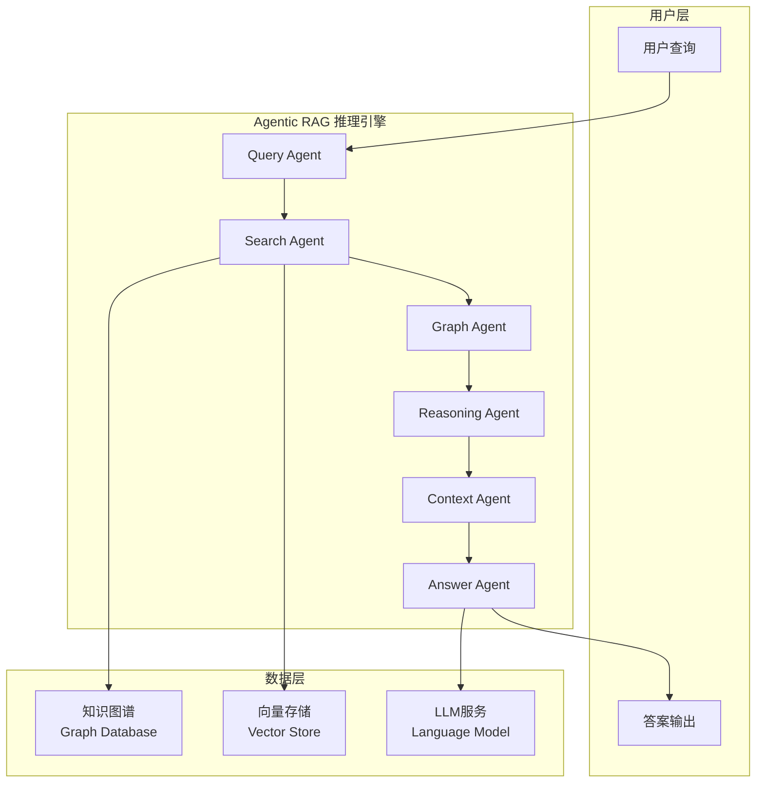

### Agent协作架构

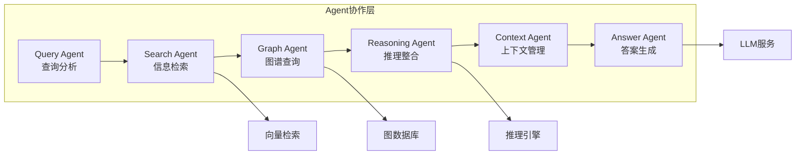

## 🔧 核心组件设计

### Agent组件架构

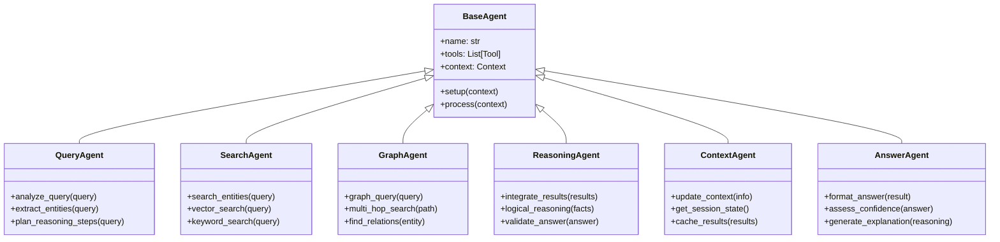

### 数据模型设计

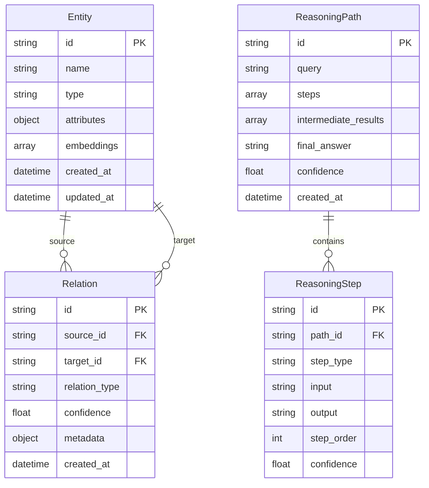

## 🔄 系统流程设计

###  文档加载与知识入库流程

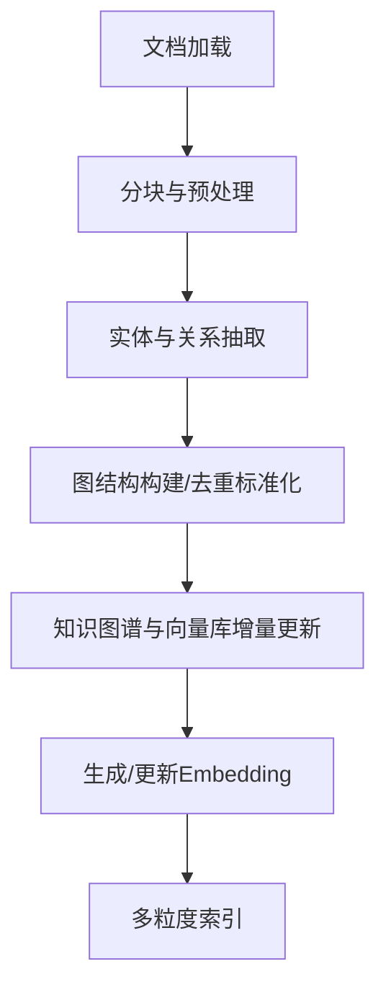

####  步骤说明
1. **文档加载**：支持多格式文档（txt/pdf/docx/csv/json等）批量导入。
2. **分块与预处理**：分块（chunking）、清洗、结构化，提升检索粒度。
3. **实体与关系抽取**：NLP/LLM方法抽取实体、关系，支持主题/概念与具体实体双层抽取。
4. **图结构构建/去重标准化**：图结构驱动，实体/关系/属性节点多类型组织，实体去重、标准化。
5. **知识图谱与向量库增量更新**：高效增量更新，无需全量重建，结构与向量信息联合索引。
6. **生成/更新Embedding**：对实体/关系生成embedding，支持结构感知嵌入。
7. **多粒度索引**：建立实体、关系、主题等多粒度索引，支持结构与向量融合检索。

---

### 查询主流程

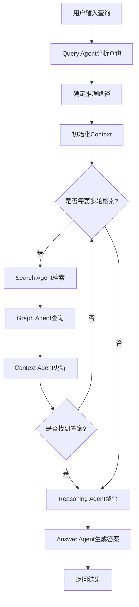

### 多跳推理流程

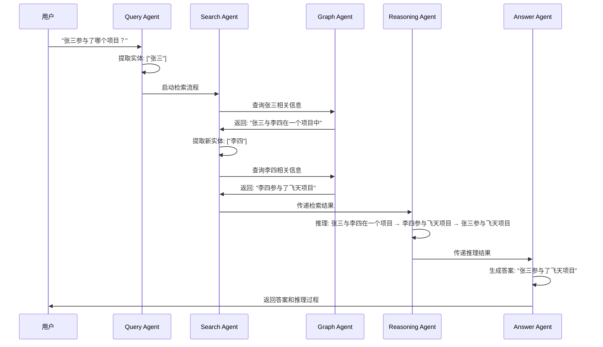

## 🗂️ 项目结构设计

```mermaid
graph TD
    A[agno-rag-system] --> B[src/]
    A --> C[data/]
    A --> D[tests/]
    A --> E[docs/]
    A --> F[config/]
    
    B --> B1[agents/]
    B --> B2[models/]
    B --> B3[services/]
    B --> B4[tools/]
    B --> B5[utils/]
    
    B1 --> B1A[query_agent.py]
    B1 --> B1B[search_agent.py]
    B1 --> B1C[graph_agent.py]
    B1 --> B1D[reasoning_agent.py]
    B1 --> B1E[context_agent.py]
    B1 --> B1F[answer_agent.py]
    
    B2 --> B2A[entity.py]
    B2 --> B2B[relation.py]
    B2 --> B2C[reasoning.py]
    
    B3 --> B3A[graph_service.py]
    B3 --> B3B[vector_service.py]
    B3 --> B3C[llm_service.py]
    
    B4 --> B4A[search_tool.py]
    B4 --> B4B[graph_tool.py]
    B4 --> B4C[reasoning_tool.py]
    
    C --> C1[mock_data/]
    C --> C2[knowledge_graph/]
    
    D --> D1[test_agents/]
    D --> D2[test_services/]
    D --> D3[test_integration/]
    
    E --> E1[requirements.md]
    E --> E2[design.md]
    E --> E3[api.md]
    E --> E4[deployment.md]
```

## 🔧 技术实现方案

### Agno框架集成

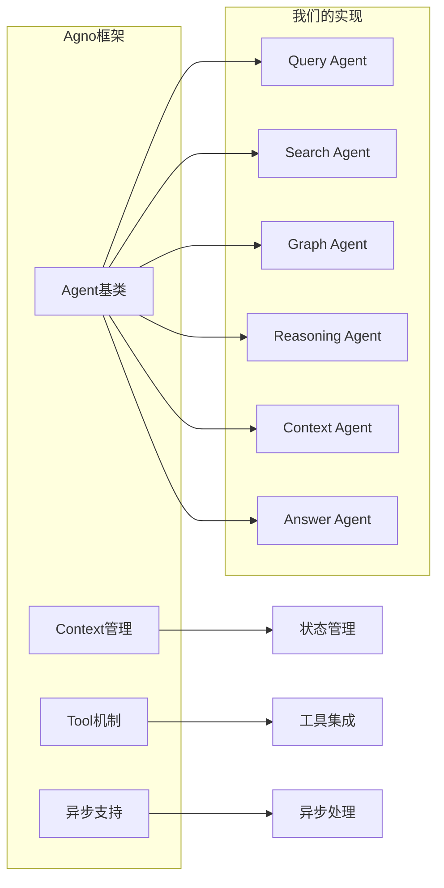

### 知识图谱实现

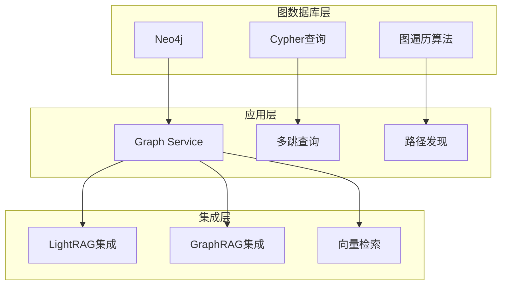

### 向量检索架构

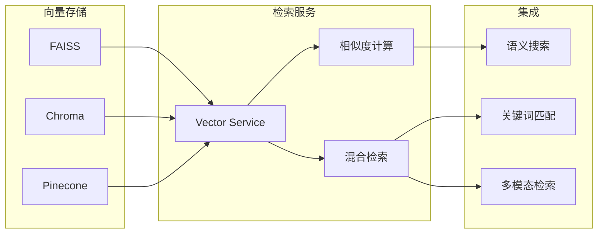

## 🧪 测试策略

### 测试架构

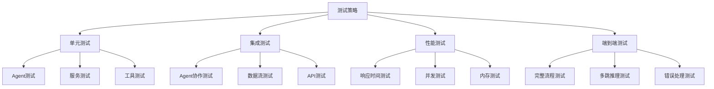

### 测试用例设计

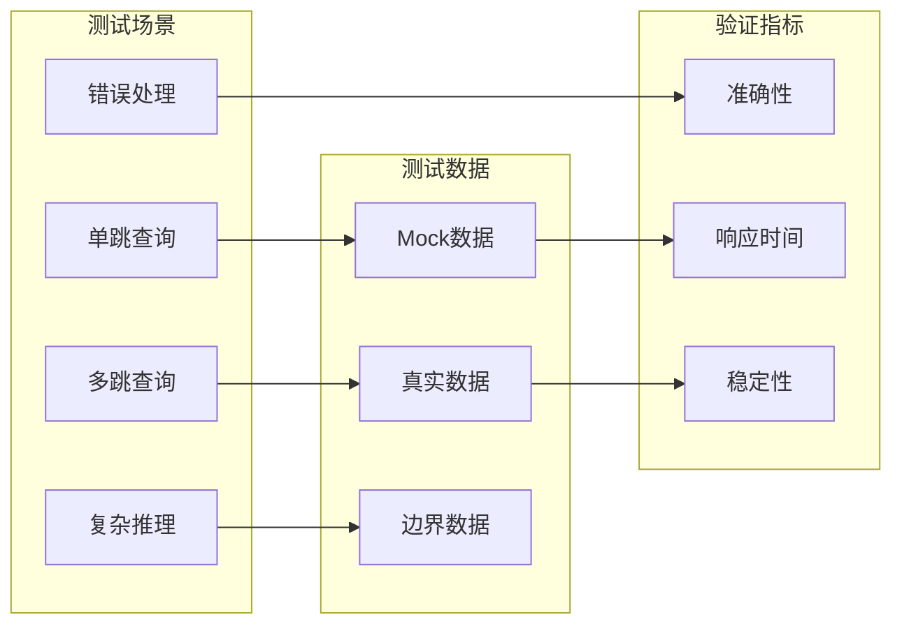

## 📊 版本管理策略

### 文档版本控制

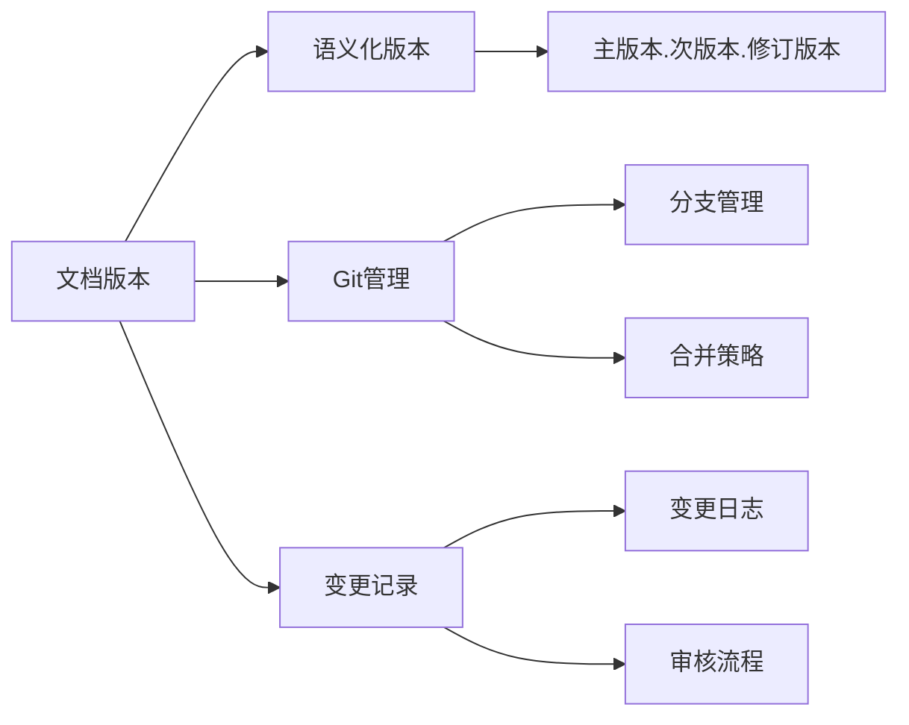

### 代码版本控制

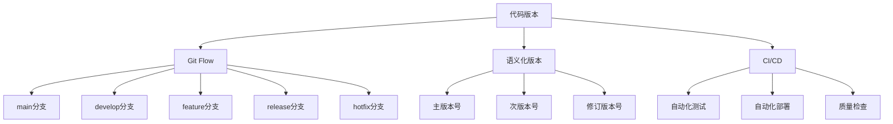

## 🚀 部署架构

### 部署流程

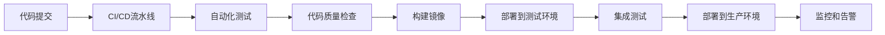

### 环境架构

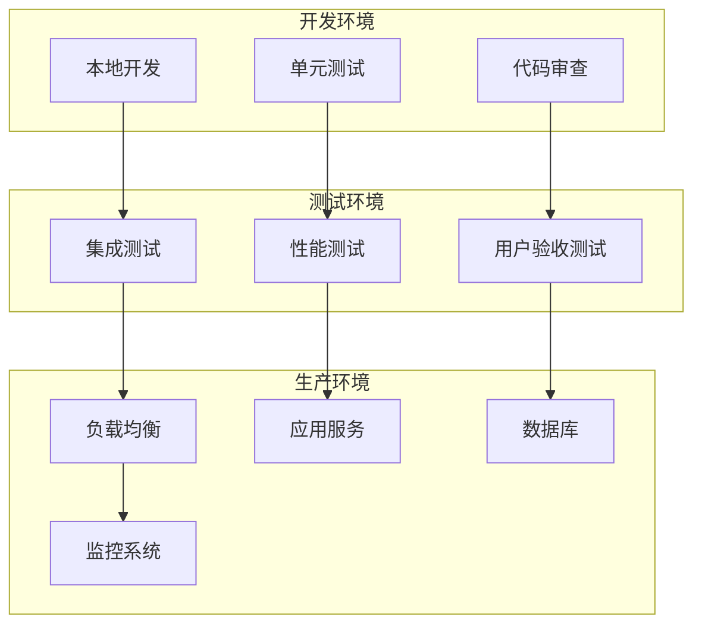

---

**文档版本历史**:
- v1.0.0 (2025-01-27): 初始版本，包含完整系统设计 