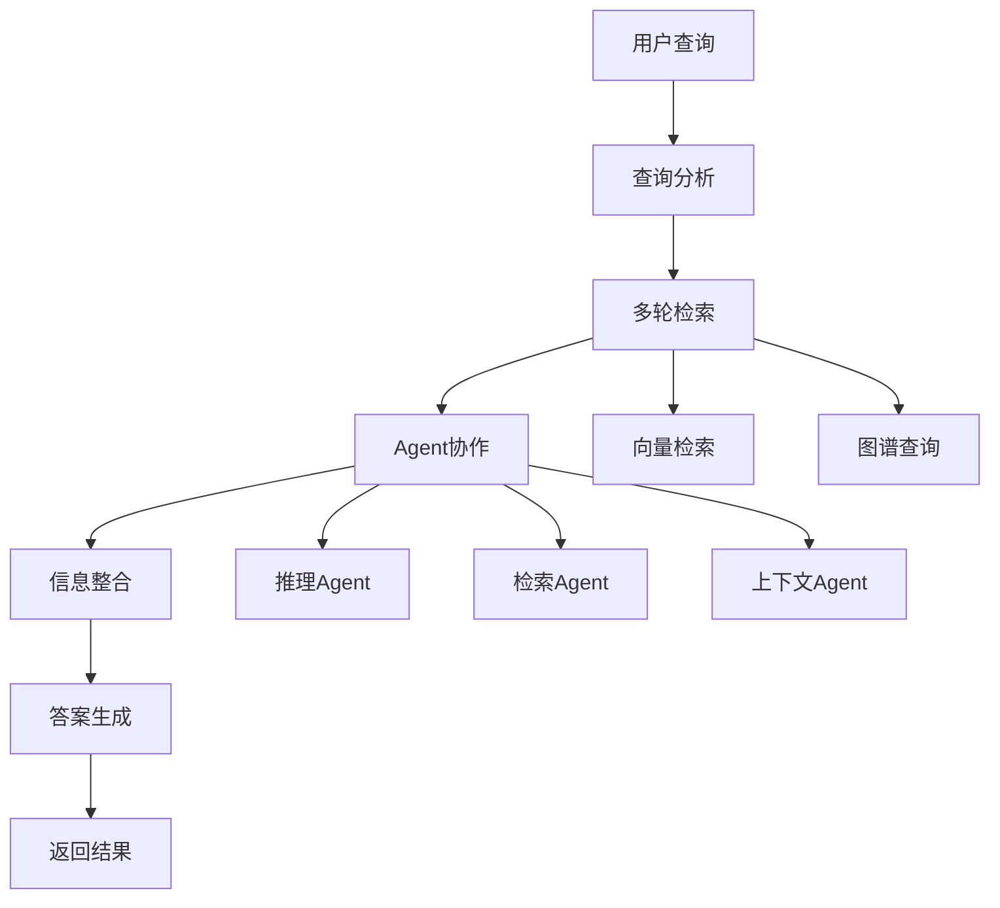
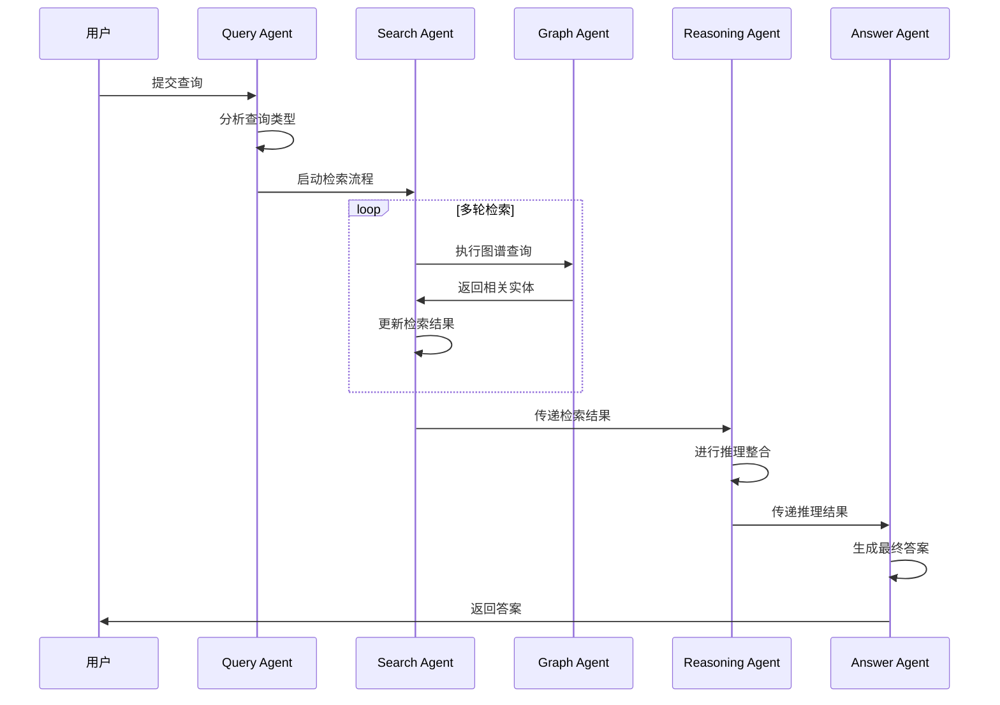
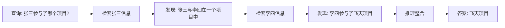
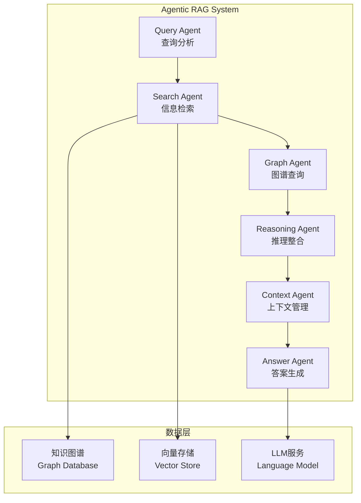
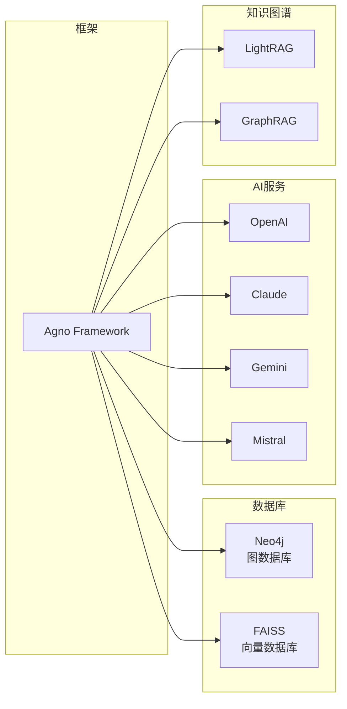
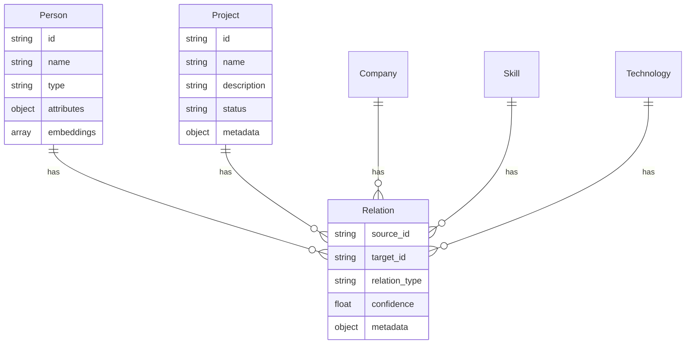
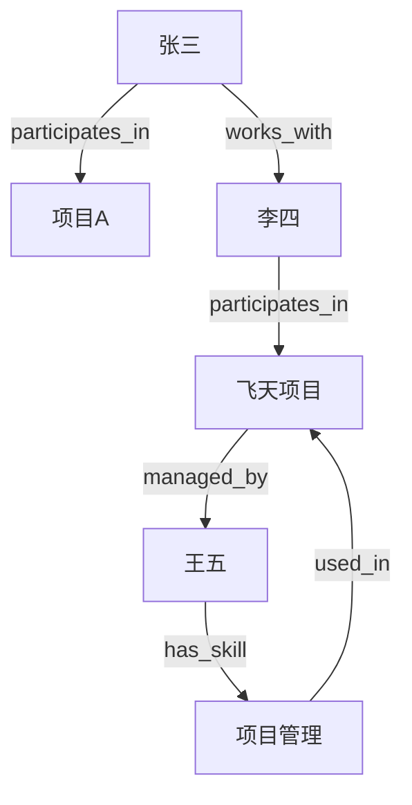

# Agentic RAG 多跳问答系统 - 需求文档

**版本**: v1.0.0  
**创建时间**: 2025-01-27  
**最后更新**: 2025-01-27  

## 📋 项目概述

### 项目信息
- **项目名称**: Agentic RAG 多跳问答系统
- **技术框架**: Agno框架
- **核心目标**: 实现支持多跳推理的知识问答系统
- **项目类型**: 企业级知识问答系统

### 背景说明

在构建企业级知识问答系统时，传统的 Naive RAG 架构往往无法支持多跳推理。例如：

- **用户提问**: 张三参与了哪个项目？
- **知识库内容**:
  - Chunk1: 张三与李四在一个项目中
  - Chunk2: 李四参与了飞天项目

Naive RAG 通常只能基于 embedding 相似度检索一个片段，无法串联多个片段来推理出"飞天项目"这一答案。

为此，我们希望引入具备多 Agent 协作能力、支持多轮信息整合的 **Agentic RAG 架构**。

## 🎯 功能需求

### 核心功能

### 系统流程

### 示例场景

## ⚙️ 技术需求

### 架构要求

### 技术栈

## 📊 数据需求

### 知识图谱结构

### Mock数据示例

## 🎯 性能要求

### 响应时间
- **单跳查询**: < 2秒
- **多跳查询**: < 5秒
- **复杂推理**: < 10秒

### 准确性
- **单跳准确率**: > 90%
- **多跳准确率**: > 80%
- **推理准确率**: > 85%

### 可扩展性
- 支持1000+实体
- 支持10000+关系
- 支持并发查询

## 📋 验收标准

### 功能验收
- [ ] 能够处理多跳推理查询
- [ ] Agent协作流程正常
- [ ] 知识图谱查询正确
- [ ] 答案生成准确

### 技术验收
- [ ] 使用Agno框架实现
- [ ] 代码结构清晰模块化
- [ ] 支持多种LLM
- [ ] 系统可正常运行

### 性能验收
- [ ] 响应时间满足要求
- [ ] 准确率达标
- [ ] 系统稳定运行

---

**文档版本历史**:
- v1.0.0 (2025-01-27): 初始版本，包含完整需求分析 